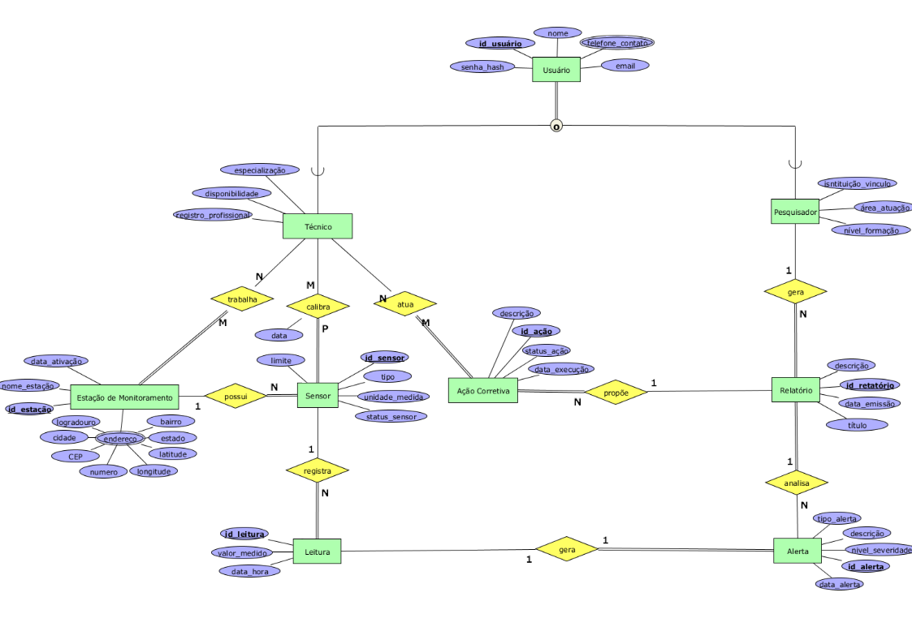

# 💧 API - Sistema de Monitoramento da Qualidade da Água

Projeto desenvolvido como parte do Programa Trainee da **COMP Júnior - UFLA**.

## 📘 Descrição

A ideia desse sistema surgiu de uma conversa com a minha namorada, que é estudante de Engenharia Ambiental e está desenvolvendo uma pesquisa sobre a qualidade da água em bebedouros da UFLA. Percebi como o processo de monitoramento ainda é bem manual e trabalhoso.

A partir disso, pensei em desenvolver uma API que automatizasse a análise, tornando o acompanhamento da qualidade da água mais rápido, acessível e confiável.

Foi dai que defini o conceito deste projeto: um sistema de monitoramento inteligente da qualidade da água, que une tecnologia e ciência pra resolver um problema real.
O projeto visa desenvolver um sistema automatizado para monitorar a qualidade da água
em estações de coleta, gerenciadas por técnicos e pesquisadores.

Nesta primeira etapa, foi criada a estrutura inicial do projeto em Node.js,
configurado o banco de dados com Sequelize e implementada a containerização com Docker (API + MySQL em containers separados).

## ⚙️ Configuração do Sequelize

O Sequelize foi configurado para gerenciar a comunicação entre a API e o banco de dados MySQL, permitindo o uso de migrations e models para estruturar o banco de forma controlada.

As credenciais estão armazenadas em um arquivo `.env`, garantindo a segurança.

## 🧠 Modelagem e Relacionamentos

O sistema representa um ambiente em que técnicos e pesquisadores atuam em estações de monitoramento equipadas com sensores automáticos.
Esses sensores registram leituras periódicas e emitem alertas quando algum parâmetro ultrapassa limites aceitáveis.
Técnicos realizam calibrações e ações corretivas, enquanto pesquisadores analisam os alertas e produzem relatórios técnicos com recomendações de solução.

As funções administrativas (como o gerenciamento de usuários e estações) serão tratadas na camada de aplicação e não como entidade no banco de dados.

<p align="center">
  
</p>

## 🗄️ Estrutura do Banco de Dados (Migrations)

As tabelas foram criadas a partir do modelo entidade-relacionamento (ER) definido para o sistema:

- Usuário
- Telefone de Contato
- Pesquisador
- Técnico
- Sensor
- Leitura
- Alerta
- Relatório
- Ação Corretiva
- Estação de Monitoramento
- Tabelas de associação: `Trabalha`, `Calibragem`, `Atuação`

Essas migrations implementam as relações e restrições de integridade descritas no diagrama ER.

## 🗃️ Models e Estrutura do Banco

Após a criação das migrations, foram implementados todos os **models** do sistema no Sequelize, refletindo as tabelas existentes no banco de dados relacional.  
Foram também definidas as **relações** entre as entidades utilizando os métodos `hasOne`, `belongsTo`, `hasMany` e `belongsToMany`, espelhando as chaves estrangeiras e associações da modelagem original.

## 🐳 Executando com Docker

Esta aplicação está containerizada com **Docker Compose**, subindo **dois serviços**:

- `apicontainer` → container Node.js (Express + Sequelize)
- `mysqlcontainer` → container MySQL 8.0

### 🔧 Pré-requisitos

- Docker e Docker Compose instalados

### 🧩 Variáveis de ambiente para Docker

No ambiente Docker, o host do banco deve ser **`DB_HOST=mysqlcontainer`** (nome do serviço do MySQL no `docker-compose.yml`).  
Exemplo de `.env` compatível com Docker:

```env
PORT=3000
DB_USER=root
DB_PASSWORD=root
DB_NAME=db_monitoramento
DB_HOST=mysqlcontainer
DB_PORT=3306
DB_DIALECT=mysql
```

### ▶️ Subindo os containers

Para iniciar o sistema completo (API + Banco de Dados), execute o comando abaixo na raiz do projeto:

```env
docker compose up --build
```

Esse comando, constrói a imagem da API, inicia o container do Node.js e o container do MySQL. Alem de criar automaticamente o banco de dados, aplicar todas as migrations e iniciar o servidor na porta 3000.

Não é necessário rodar manualmente os comandos yarn sequelize db:create nem yarn sequelize db:migrate.
Todo o processo é automatizado quando os containers sobem.

## 🚀 Comandos para Executar o Projeto Localmente

Abaixo estão todos os comandos necessários para configurar o ambiente, criar o banco de dados, rodar as migrations e iniciar o servidor localmente.

### 💻 Requisitos de Software

- **Node.js** → versão 18 ou superior  
  (necessário para executar o servidor e o Sequelize)

- **Yarn** → gerenciador de pacotes utilizado no projeto  
  (instale com `npm install --global yarn` caso ainda não possua)

- **MySQL Server** → versão 8.0 ou superior  
  (precisa estar em execução localmente na porta **3306**)

- **Git** → para clonar o repositório e versionar o código

- **DBeaver** ou **MySQL Workbench** _(opcional)_ → para visualizar as tabelas e testar a conexão com o banco de dados

---

### 🔐 Configuração do arquivo `.env`

Antes de rodar o projeto, é necessário criar um arquivo chamado `.env` na **raiz do projeto** (no mesmo nível do `package.json`).

Esse arquivo contém as credenciais de acesso ao banco de dados e outras variáveis de ambiente utilizadas pelo Sequelize.

Use o modelo abaixo como referência:

```env
PORT=3000
DB_USER=root
DB_PASSWORD=sua_senha
DB_NAME=projeto_agua
DB_HOST=localhost
DB_PORT=3306
DB_DIALECT=mysql
```

### ▶️ Passo a passo

```bash
git clone https://github.com/resndph/projeto-trainee-backend.git
yarn install
yarn sequelize db:create
yarn sequelize db:migrate
yarn start
```

---

### 🌐 Acesso à API

Após iniciar o servidor, o sistema ficará disponível em:
👉 http://localhost:3000

## 👤 Desenvolvido por

**Pedro Henrique Fonseca Resende** – Trainee COMP Júnior (UFLA)
